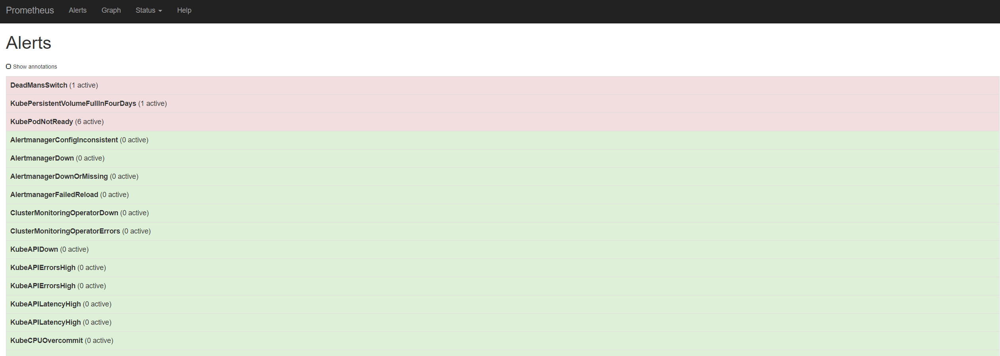

# Exercise 6: Monitoring and Logging
OpenShift provices both a monitoring and logging stack out-of-the-box. The monitoring stack is prometheus and grafana while the loging stack is kibana, elasticsearch and fluentd.

The monitoring stack not only provides details performance monitoring of the cluster but also providers alerting. Prometheus provides a basic UI for viewing alerts and monitors but OpenShift provides ready-to-go Grafana dashboards that can of course be customized. Most development teams will also want to run their own prometheus in their namespaces to capture and report their application metrics.

Below is the monitoring stack architecture.

## Prometheus Graphs and Alerts
Using browser connect to prometheus monitoring.

[Prometheus Graphs](https://prometheus-k8s-openshift-monitoring.apps.5.9.163.226.xip.io)

Select the graph tab. Next select node_memory_active from the metrics dropdown and execute to see a graph on namespaces and their memory usage.

Select alert tab. This shows the alerts that are configured.

Next lets look at where to configure alerts. Using browser connect to prometheus alert manager. You will need to login as monitor user. Only a user with minimum role of cluster-monitoring-view can login. Notice the alert manager is using OpenShift to authenticate users.

[Prometheus Alerts](https://alertmanager-main-openshift-monitoring.apps.5.9.163.226.xip.io)

One of the pre-configured alerts is KubePodNotReady. Select the '+ Info' to see alerts for this monitor. Here we see the logging curator pod is not ready.

Your users do not have permission to view the openshift-logging project however, below you can see this pod having issues.

## Grafana
Using browser connect to grafana.

[Grafana](https://grafana-openshift-monitoring.apps.5.9.163.226.xip.io) 

You will need to login as monitor user. Only a user with minimum role of cluster-monitoring-view can login. Notice Grafan is using OpenShift to authenticate users.

On the top left, next to Grafana logo, select a dashboard from dropdown. The general dashboards are those that ship with OpenShift out-of-the-box. Here we will look at the CPU and Memory utilization of the cluster.

Next select the K8s / Compute Resources / Namespace dashboard. Select your student namespace and you can view utilization of the namespace. Finally select the pod and now we can drill into the hello-kubernetes pod we deployed.

# Logging
As mentioned the logging stack used by OpenShift is EFK. On each node a fluentd pod runs as daemon-set, collects logs from all pods running on nodes and forwards them to elasticsearch. You can also optionally have fluentd forward logs to other logging frameworks. Kibana provides a UI and is also namespace aware. The student users can login using OpenShift to authenticate and view logs for their projects. As you can image with microservices you will have a lot of pods running and unlike a monolithic application without proper log aggregation and ability to search, the environment will simply be unmanagable.

Using browser connect to Kibana.

[Kibana](https://logging.apps.5.9.163.226.xip.io)

Upon logging in you will be placed in your student namespace and see all the logs. At the upper right you can change the timeframe for the logs, you may need to view logs of day to see them all. In the middle you can search, for example by pod label 'hello-kubernetes'.

